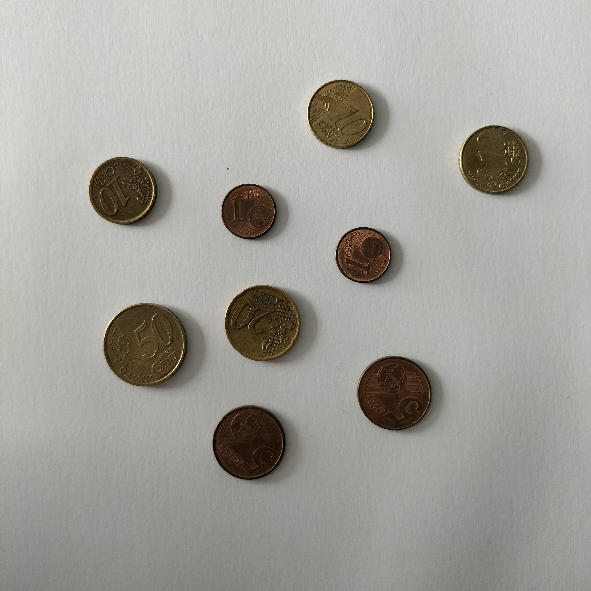
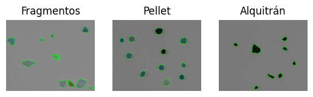
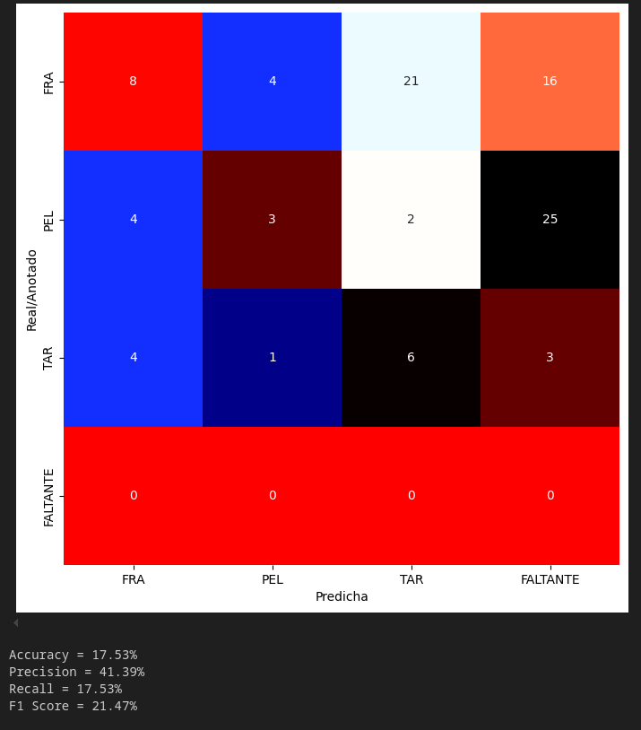

# Visión por Computador | Práctica 3

  

Esta práctica ha permitido trabajar con técnicas de procesamiento digital de imágenes orientadas a la **identificación y clasificación de objetos**. Se han abordado dos ejercicios principales: la estimación de la cantidad de dinero en una imagen de monedas y la clasificación de partículas de microplásticos.

En la primera tarea se implementó un contador de monedas utilizando únicamente el **área de los contornos** como característica. Este planteamiento llega a buenos resultados, ya que permite asignar correctamente el valor de cada moneda con una mínima complejidad. Para contrarrestar errores derivados de sombras o variaciones de iluminación, se utiliza una referencia interactiva seleccionando una moneda de valor conocido; se asume que el efecto de la sombra se aplica de forma proporcional a todas las monedas, lo que mejora la fiabilidad de la estimación. Con este enfoque, la detección y el cálculo total funcionan bastante bien, mostrando resultados consistentes en la mayoría de los casos.

En la segunda tarea se abordó la **clasificación de microplásticos**. La primera fase del ejercicio, consistente en extraer los contornos de las imágenes de partida y calcular vectores de características representativos por categoría, se realiza de manera correcta y permite un análisis inicial adecuado. Sin embargo, la clasificación final de las partículas en la imagen de test muestra limitaciones importantes, reflejadas en un bajo rendimiento de las métricas de exactitud, precisión y puntuación F1. Esto podría indica que el planteamiento inicial funciona, pero que es necesario mejorar la selección y ponderación de las características, así como la obtención de los contornos de la imagen a procesar. Es posible que añadir más características pudiera aumentar la fiabilidad del sistema de clasificación.

  

  

---

## Fuentes

Las siguientes fuentes han sido utilizadas durante el desarrollo de la práctica para consultar técnicas y funciones de procesamiento de imágenes:

* **Documentación de OpenCV 2.4.13.7**: [https://docs.opencv.org/2.4.13.7/genindex.html](https://docs.opencv.org/2.4.13.7/genindex.html)
* `cv2.findContours`: [https://docs.opencv.org/2.4.13.7/d9/d8b/tutorial_py_contours_hierarchy.html](https://docs.opencv.org/2.4.13.7/d9/d8b/tutorial_py_contours_hierarchy.html)
* `cv2.threshold` y umbral adaptativo: [https://docs.opencv.org/2.4.13.7/doc/tutorials/imgproc/threshold/threshold.html](https://docs.opencv.org/2.4.13.7/doc/tutorials/imgproc/threshold/threshold.html)
* `cv2.fitEllipse`: [https://docs.opencv.org/2.4/modules/imgproc/doc/structural_analysis_and_shape_descriptors.html#cv2.fitellipse](https://docs.opencv.org/2.4/modules/imgproc/doc/structural_analysis_and_shape_descriptors.html#cv2.fitellipse)
* `cv2.cvtColor`: [https://docs.opencv.org/2.4.13.7/modules/imgproc/doc/miscellaneous_transformations.html#cv2.cvtColor](https://docs.opencv.org/2.4.13.7/modules/imgproc/doc/miscellaneous_transformations.html#cv2.cvtColor)
* `cv2.imshow` y visualización: [https://docs.opencv.org/2.4.13.7/modules/highgui/doc/user_interface.html#cv2.imshow](https://docs.opencv.org/2.4.13.7/modules/highgui/doc/user_interface.html#cv2.imshow)

---

Autor: Oliver Cabrera Volo
