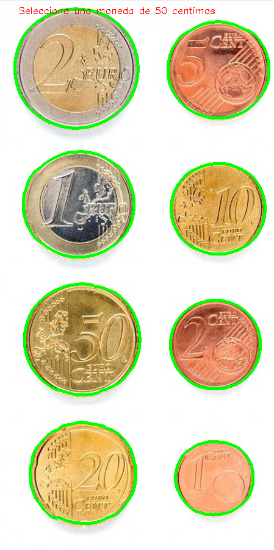
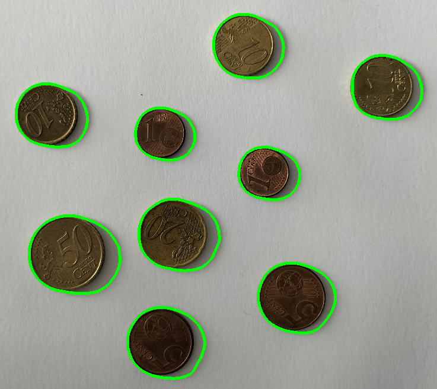

# Visión por Computador | Práctica 3

<p align="center">
  
</p>

## Requisitos para la ejecución del cuaderno

Para la ejecución del cuaderno es necesaria la versión **3.11.5** de **Python**, junto a las siguientes librerías:

```text
numpy==2.2.6
opencv-python==4.12.0.88
matplotlib==3.10.6
scikit-learn==1.7.2
seaborn==0.13.2
```

## Desarrollo

Esta práctica ha permitido trabajar con técnicas de procesamiento digital de imágenes orientadas a la **identificación y clasificación de objetos**. Se han abordado dos ejercicios principales: la estimación de la cantidad de dinero en una imagen de monedas y la clasificación de partículas de microplásticos.

### 1. Estimación de la cantidad de dinero

En la primera tarea se implementó un contador de monedas utilizando únicamente el **área de los contornos** como característica principal para identificar el valor de cada moneda. Este planteamiento es sencillo, pero consigue asignar correctamente los valores en la mayoría de los casos. Para contrarrestar errores derivados de sombras o variaciones de iluminación, se emplea una referencia interactiva seleccionando una moneda de valor conocido (una moneda de 50 céntimos). Se asume que el efecto de la sombra se aplica de forma proporcional a todas las monedas, lo que evita que los errores puedan afectar de manera significativa a la estimación final. Con este enfoque, la detección y el cálculo total funcionan bastante bien, mostrando resultados consistentes en la mayoría de los casos.

En el caso de la imagen de monedas proporcionada, se obtiene correctamente la cuenta:

<p align="center">
  
</p>

La salida de la ejecución de la celda es `Cuenta total: 3.88 €`, por lo tanto, no se han cometido errores al identificar la cantidad de dinero.

En otra imagen con más sombras, la estimación no resulta tan precisa:

<p align="center">
  
</p>

El resultado de la celda es `Cuenta total: 1.04 €`, lo que difiere en unos céntimos del valor real. Esto puede deberse a la similitud en el área entre las monedas de 10 y 5 céntimos, lo que complica su diferenciación con este método.

### 2. Clasificación de partículas de microplásticos

En la segunda tarea se abordó la **clasificación de microplásticos**. La primera fase del ejercicio, consistente en extraer los contornos de las imágenes de partida y calcular vectores de características representativos por categoría, se realizó de forma correcta y permitió un análisis inicial adecuado.

El vector de características utilizado tiene en cuenta la **compacidad** (relación entre el área y el perímetro al cuadrado), la **relación entre el eje mayor y el eje menor** de una elipse que intenta ajustarse al contorno, y los valores **HSV del centro del contorno**, que aportan información del color.

<p align="center">
  
</p>

Sin embargo, la clasificación final de las partículas en la imagen de prueba presenta limitaciones importantes, reflejadas en un bajo rendimiento en métricas como la exactitud, la precisión y la puntuación F1. Esto podría indicar que el planteamiento inicial es funcional, pero insuficiente. Sería necesario mejorar la selección y ponderación de las características, así como la calidad de la segmentación de los contornos. Es posible que añadir nuevas características, como la saturación y el brillo relativo de los contornos respecto al resto de fragmentos, pudiera aumentar la fiabilidad del sistema de clasificación.

<p align="center">
  
</p>

En la matriz de confusión se observa como el clasificador identifica de manera errónea a partículas de fragmentos como partículas de alquitrán. Los fragmentos que menos logra identificar son los "pellets".

---

## Fuentes

Las siguientes fuentes han sido utilizadas durante el desarrollo de la práctica para consultar técnicas y funciones de procesamiento de imágenes:

* **Documentación general de OpenCV 4.x**: [https://docs.opencv.org/4.x/](https://docs.opencv.org/4.x/)
* `cv2.findContours`: [https://docs.opencv.org/4.x/df/d0d/tutorial_find_contours.html](https://docs.opencv.org/4.x/df/d0d/tutorial_find_contours.html)
* `cv2.threshold` y umbral adaptativo: [https://docs.opencv.org/4.x/d7/d4d/tutorial_py_thresholding.html](https://docs.opencv.org/4.x/d7/d4d/tutorial_py_thresholding.html)
* `cv2.fitEllipse`: [https://docs.opencv.org/4.x/d3/dc0/group__imgproc__shape.html#ga44ea9fbbf26df3f44c2c05b56f7fcf62](https://docs.opencv.org/4.x/d3/dc0/group__imgproc__shape.html#ga44ea9fbbf26df3f44c2c05b56f7fcf62)
* `cv2.cvtColor`: [https://docs.opencv.org/4.x/d8/d01/group__imgproc__color__conversions.html](https://docs.opencv.org/4.x/d8/d01/group__imgproc__color__conversions.html)
* `cv2.imshow` y visualización: [https://docs.opencv.org/4.x/d7/dfc/group__highgui.html#ga7c2f3c6275c8d76c51200b246b06b195](htcccccccccctps://docs.opencv.org/4.x/d7/dfc/group__highgui.html#ga7c2f3c6275c8d76c51200b246b06b195)

---

Autor: Oliver Cabrera Volo
